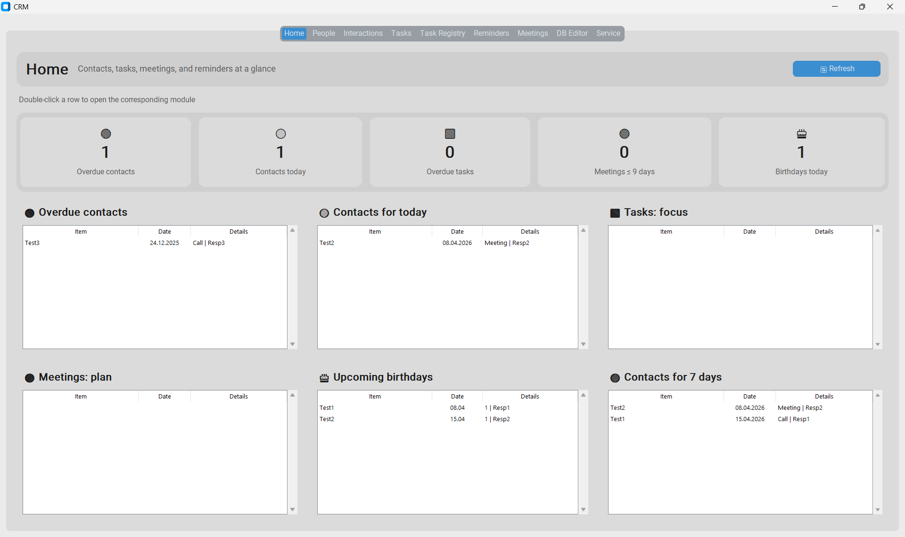
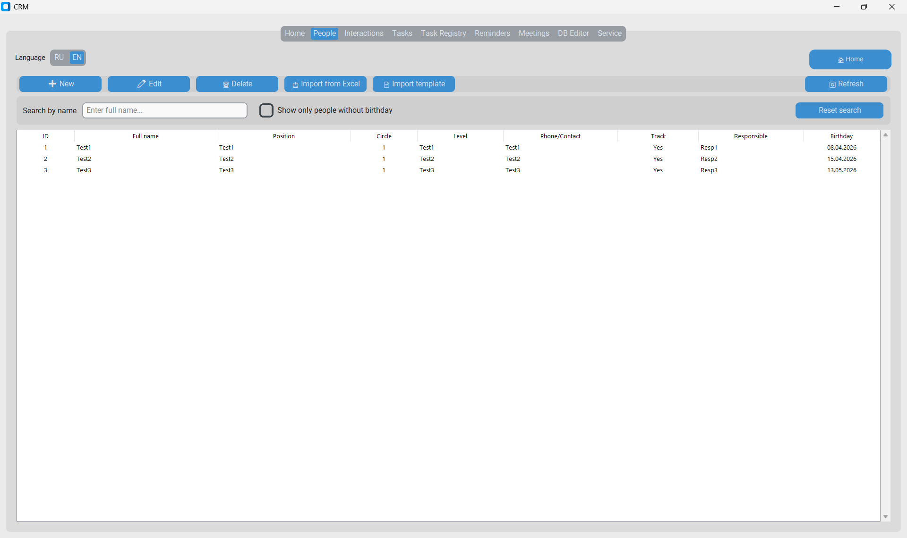
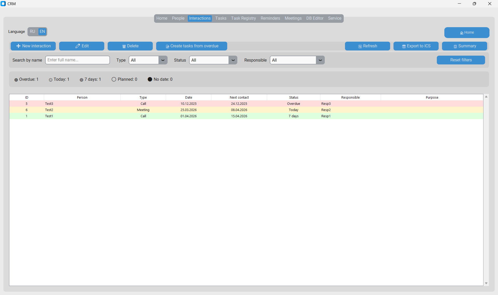
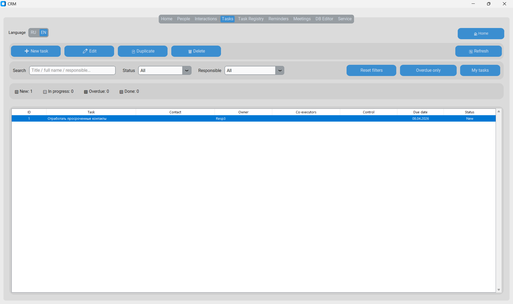
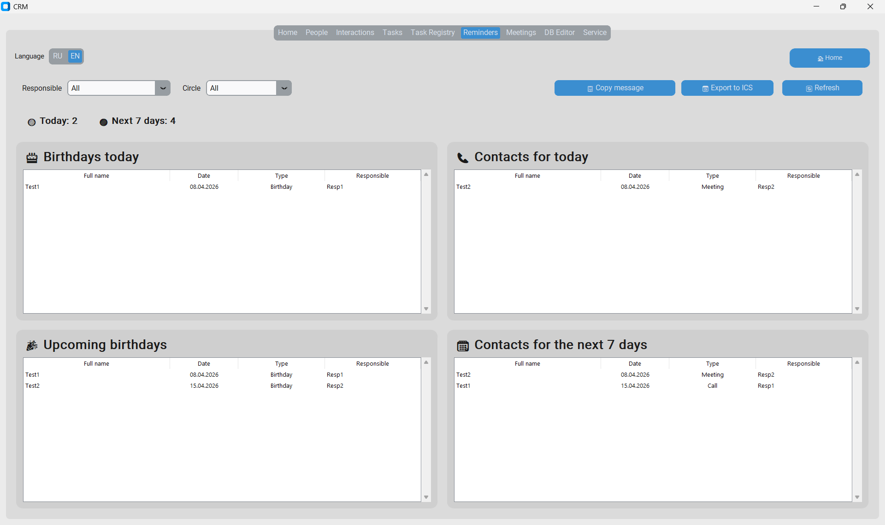
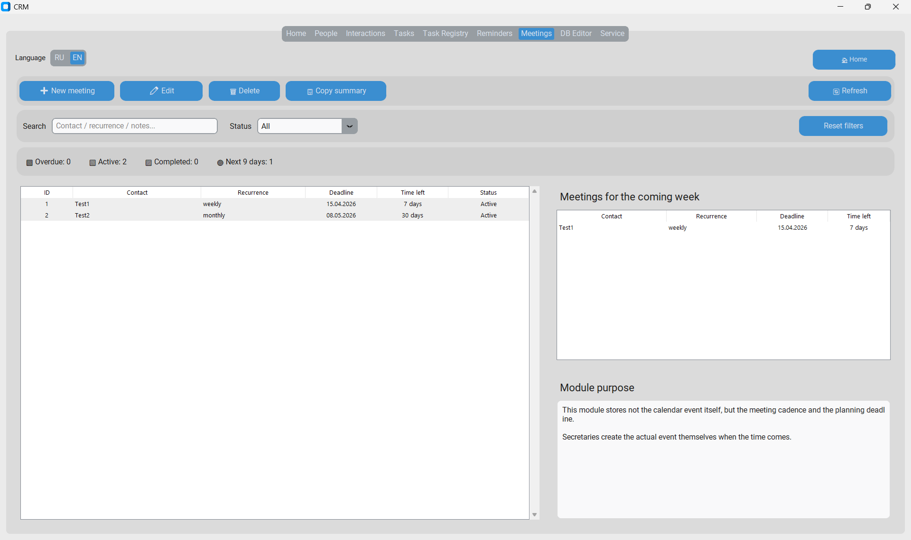
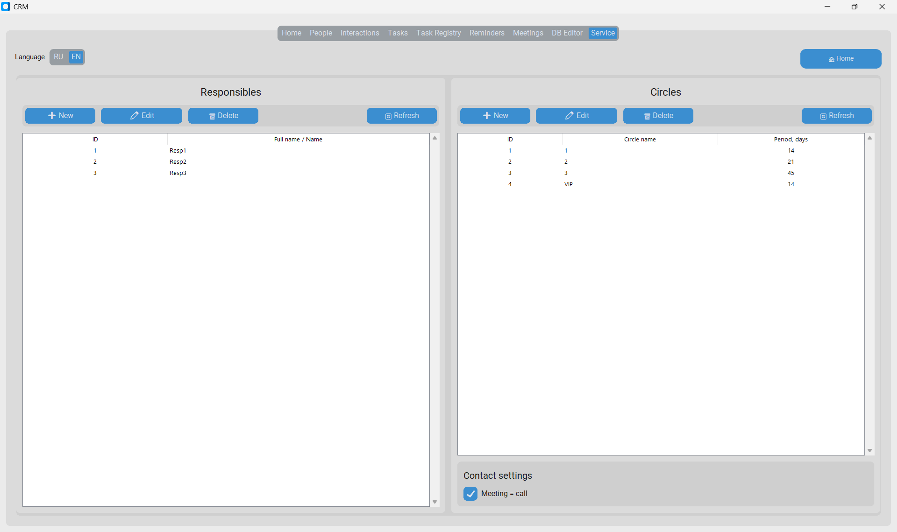
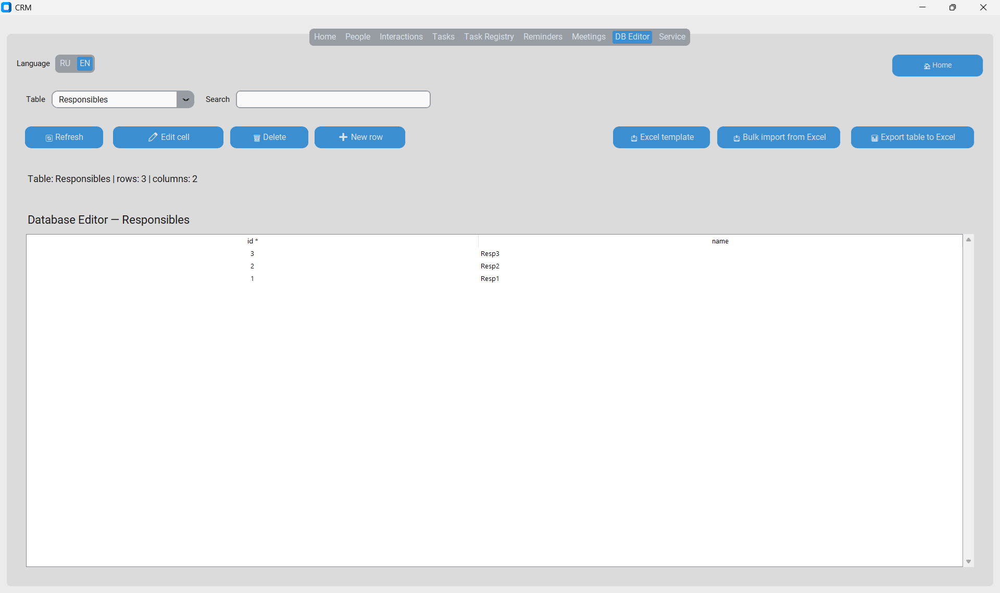

# Task Management CRM System

Desktop CRM / task registry system for managing contacts, interactions, meetings, reminders, and operational tasks.

## Overview

This project is a desktop Python application built for structured relationship management and task control in a real operational environment.

The system combines:
- contacts database
- interaction tracking
- meetings registry
- task control
- reminders
- dashboard and filtering tools

## Key Features

- Persons registry
- Interactions management
- Meetings management
- Task registry
- Reminder module
- Reference dictionaries
- Status tracking and filters
- Dashboard with counters and summaries
- SQLite database
- Desktop UI based on tkinter / customtkinter

## Screenshots

<p align="center">
  
  
</p>

<p align="center">
  
  
</p>

<p align="center">
  
  
</p>

<p align="center">
  
  
</p>

## Tech Stack

- Python
- customtkinter / tkinter
- SQLite
- SQLAlchemy

## Project Structure

```text
dialogs/     - modal windows and edit forms
models/      - data models
services/    - business logic and data operations
ui/          - application tabs and interface
database.py  - database initialization
main.py      - application entry point